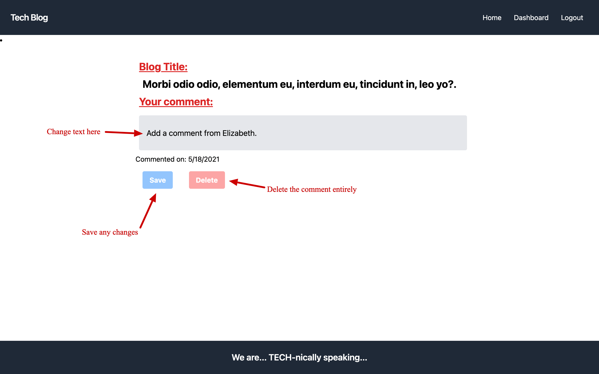

# Tech_Blog

## Description

Tech_Blog is a simple CMS-style blog website, with a focus on MVC systems in the architectural structure. Using templates from Handlebars.js, Sequelize as the ORM, and Expess-session npm for authentication. Tailwind CSS has been used for all styling. 

You can access more badges and their purposes at [shields.io](https://shields.io)

## Table of Contents
  * [Usage](#usage)
  * [Questions](#questions)
  * [License](#license)
     
      
## Usage

  _Instructions for use:_

  ### Table of Contents
  * [View Blog & Comments](#View_Blog)
  * [Sign-Up or Sign-In](#Sign_Up)
  * [User's Dashboard](#User_Dashboard)
  * [Edit Your Blog](#Edit_Blog)
  * [Create Blog](#Create_Blog)
  * [View Your Comments](#View_Comments)
  * [Edit Comments](#Edit_Comments)

  
&nbsp

  Once on the heroku website, you are taken to homepage that will have any previously saved blogs. 

  
&nbsp

  

  
&nbsp

  ### View_Blog
  
  
  Clicking the title of one of these blogs will take you to that blog and it's comments. However, you can not edit any comments or blog posts without logging in. 

  
&nbsp

  

  
&nbsp

  ### Sign_Up

  You can only edit your own blog posts or comments, you do so by selecting login, or dashboard from the navigation bar. Either one will take you to the sign in page. If you do not have an account you can also choose the option _Need to Sign-Up?_ this will take you to a similiar page where you can create your username and password. After you have completed either of these options, you are taken to your personal dashboard page.

  
&nbsp

  

  
&nbsp

  ### User_Dashboard

  Once logged in you are taken to your personal dashboard where you can see all blog post that you have created. If you are new to the site you will not see any post, but you will be able to create one! _You can also still comment on other posts even if you have none of your own, as long as you are logged in_. You can also view all your comments independent of going to the actual blog, for quick accessibility. First let's take a look at your dashboard. You will also notice that the navigation bar has changed login to logout. You have a idle timer of five minutes before you are automatically logged out and will need to log back in to go to your dashboard or to create/edit your comments/posts.

  
&nbsp

  

  
&nbsp

  ### Edit_Blog

  From your dashboard if you select the option to edit a post, you are taken to an editing area with the single post where you can see the title, the content, and all messages for your post. You can simply type in the text areas to change either title or content, simply click _Save post_ when you are done with your changes. You will be taken back to the dashboard and will see the updated post immeadiately. You also have an option to delete the post, which will also take you back to the dashboard and you will see that the post has been removed. You can also add a comment to your own post! After typing your comment in the text box, simply click _Add comment_. If you don't want any of these options you can always go back to your dashboard with the link at the bottom of the page.

  
&nbsp

  

  
&nbsp

  ### Create_Blog

  From the dashboard if you choose to create a new post, you are taken to a page with an input for a title, and for the blog content. There is a create button as well. 

  
&nbsp

  

  
&nbsp

  ### View_Comments

  If you wish to view your comments without searching through each individual blog, there is an option in your dashboard. It allows you to see the title of the blog you commented on as well as the date you commented. Then an option to edit which comment you choose. If you don't remember the blog content, you can click the title of the blog to get a refresher of the content.

  
&nbsp

  

  
&nbsp

  ### Edit_Comments

  After you select the comment you want to edit/delete, you can select the text area with your comment and make any changes to the text. You could also simply delete the comment as well.

  
&nbsp

  

  
&nbsp

  A user session ends when they select the logout option from the navigation bar, or the five minute idle limit is reached.

  Thank you so much for your time, and for a dynamic experience of the application, please visit [the heroku deployment of the application](https://damp-retreat-25612.herokuapp.com/)

  [Back to the top](#Tech_Blog)

  
&nbsp

      
## Questions
      
  _For further questions:_

  GitHub: [JOHNBANAS](https://github.com/JOHNBANAS)

  Email: [jbanas9124@gmail.com](mailto:jbanas9124@gmail.com)

  
&nbsp

    
## License

      
  _This application has the MIT License._
      
  For more information please view the [license description](https://choosealicense.com/licenses/mit/).
  
  